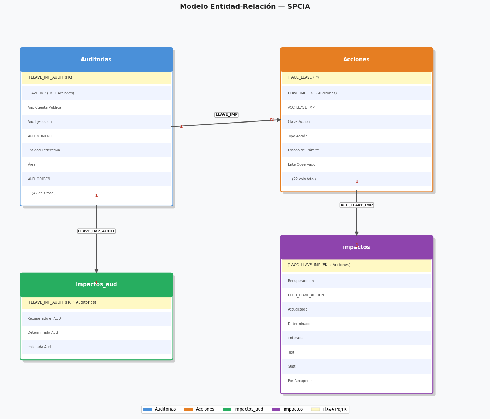
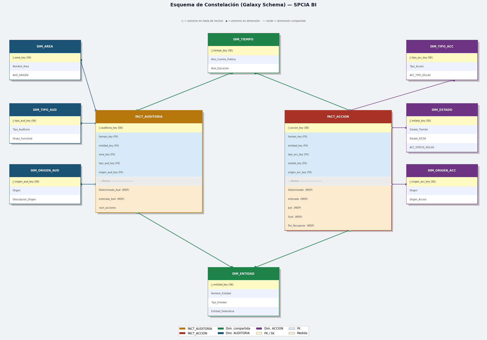
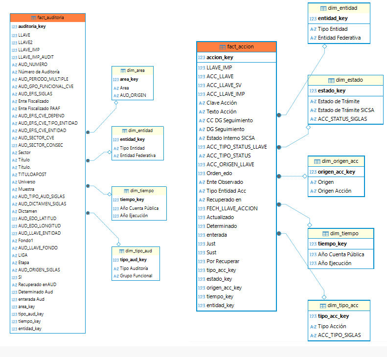
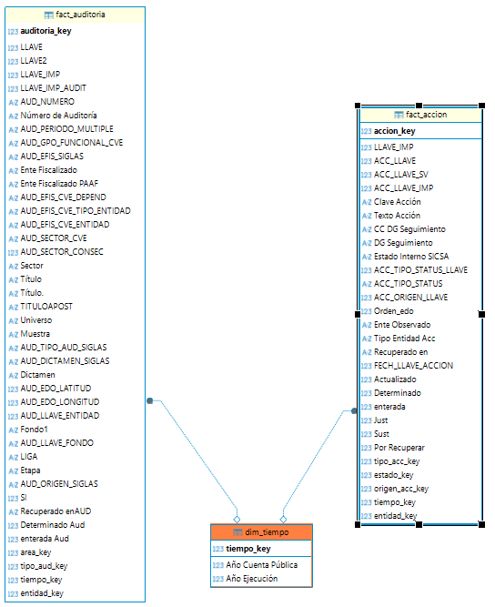
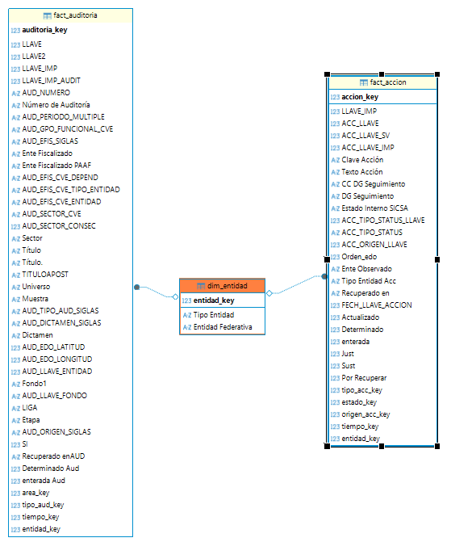
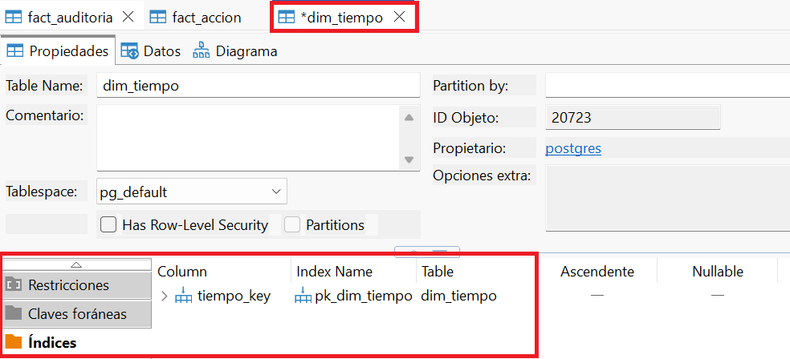

# ETL-RAG-LLM
ETL process to prepare data for RAG and LLM, data is loaded to the PostgreSQL database. The data will be separeted into many tables (dimensions) to help the LLM to understand easily the data to answer the questions (see Fig. 1 and 2).

Fig. 1: Original tables.


Fig. 2: Final tables and dimensions.

## 🚀 How to run locally
1. Clone this repository:
```
git clone https://github.com/departamentoIA/ETL-RAG-LLM.git
```
2. Set virtual environment and install dependencies.

For Windows:
```
python -m venv env
env/Scripts/activate
pip install -r requirements.txt
```
For Linux:
```
python -m venv env && source env/bin/activate && pip install -r requirements.txt
```
In order to set the Jupyter Kernel (if necessary), run:
```
python -m ipykernel install --user --name=env --display-name "Python (env)"
```
3. Run "etl_rag_llm.ipynb" (Excel files are not provided).

## 🎯 Results
All tables are loaded to the PostgreSQL database, primary and foreign keys, table indexes are also created, according to the primary keys.


Fig. 3: Tables 'fact_auditoria', 'fact_accion' and dimensions.


Fig. 4: Relations between tables by dim_tiempo.


Fig. 5: Relations between tables by dim_entidad.


Fig. 6: Index created according to primary key.